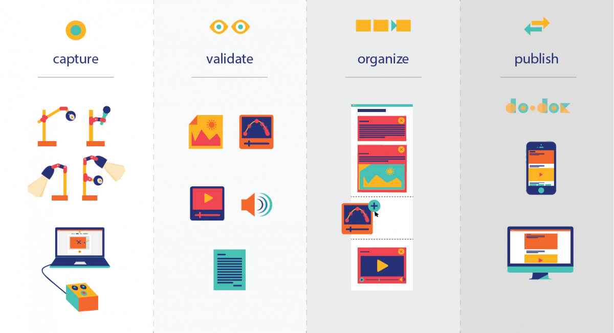
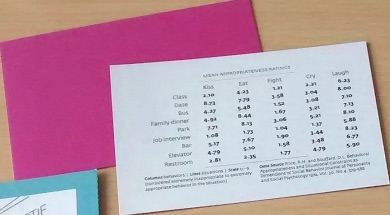
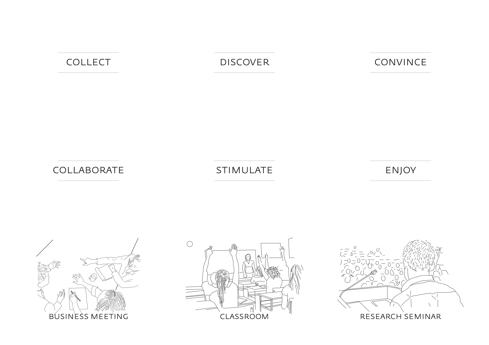
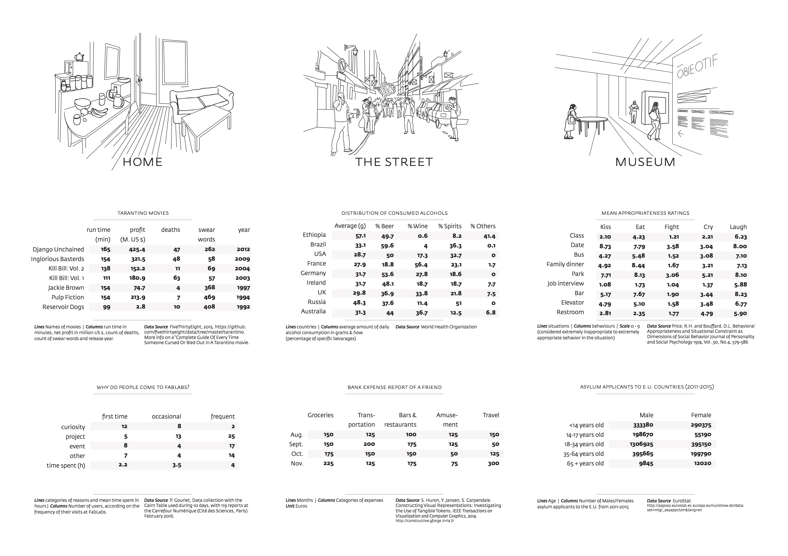

## Workshop Report

The DRS workshop was the fourth in a series of loosely connected workshops on the topic of data physicalization and the first one with a clear focus on design exploration. We, the organizers, had previously organized data physicalization workshops in different settings and context. Yvonne and Trevor ran workshops at academic conferences on HCI or visualization (ACM TEI, ACM CHI, IEEE VIS) and Samuel Huron organized workshops in more informal settings like science fairs (Futur en seine) or community associations. While these previous workshops focused on either researchers with a visualization and/or human-computer interaction background, or on the general public, we expected at DRS to meet design practitioners, designers, and design researchers. Thus we designed a specific workshop for these attendees focusing on design explorations with physical data representations. We got some interesting results which we summarize below in this article.

Our initial goals were:

  * to provide a fruitful and enjoyable experience to our participants,
  * to design a new type of physicalization workshop engaging for designers,
  * to observe how workshop materials affect what participants produce.

Below we briefly present the workshop procedure, setup, and materials. Then we report on the outcomes: what participants have created and what we enjoyed the most.

## Workshop Introduction

During the introduction we shortly presented our backgrounds and the workshop activities (see slides below).  
We also did a round robin where each participant had the opportunity to present themself.

	<iframe src="https://docs.google.com/presentation/d/1YQSuMf44jIPykxqUCOv8mfi-p5lMy7Q-uxf2I473i8U/embed?start=true&amp;loop=true&amp;delayms=3000" style="position: absolute; top: 0; left: 0; width: 100%; height: 100%" webkitallowfullscreen="true"></iframe>

## Do.doc Demo

  

[][1] After presenting the full activity, Pauline Gourlet gave a quick demo how to use [do.doc][2]. Do.doc is a system to document design and learning activities, and we asked our participant to use it to create two documents over the course of the workshop: a documentation of their creation process and a document that explains and presents their physicalization to people who did not participate in their creative process.

## Design constraints

[][3] We structured the workshop activities through a set of cards defining design constraints for the different participant groups. These constraints indicated a data set that the data physicalization should convey, a physical environment where it will be used, and a &#8220;task&#8221; that it should support. The different types of cards are color-coded on the back such that their type can be recognized while its content remains hidden underneath. Each group picked one card of each type.

The content of the cards (we publish the source files under a creative commons license – see the bottom of this page for details):  
[][4] [][5]

The random draw of cards resulted in the following combinations:

| Group | Dataset                                         | Situation        | Task        |
| ----- | ------------------------------------------------------------------------- | -------------------------------------------- | ------------------------------------- |
| 1     | Distribution of consumed alcohols               | Museum           | Enjoy       |
| 2     | Asylum applicants to e.u. countries (2011-2015) | Classroom        | Collaborate |
| 3     | Why people come to fablabs?                     | Research seminar | Discover    |
| 4     | Tarantino movies (profits, death, Swear words)  | Home             | Communicate |
| 5     | Mean appropriateness rating                     | Business Meeting | Collect     |

## Reading the data

Participants were invited to choose a table. All groups had five to ten minutes to familiarize themselves with the dataset, the task and the situation. This was a moment to reflect on these three cards and their content and to discuss what and how to physicalize it as a group.

&nbsp;

[][6]

## Selecting materials

[][7]

[][8] To build physicalizations, it is necessary to have materials. So we bought and brought a lot of different materials: craft paper, different shapes of pasta, (pearl) clay, kapla, plastic tokens square and round, Lego bricks, pipe cleaners, wooden sticks, wool, food coloring, plastic cups, water bottles, stickers, and others. Important for us when choosing these materials was that they cover a range of different material properties such as bendable, pourable, malleable, etc. The only constraint for choosing materials was to select **a maximum of 3 different materials** to build the physicalization.

We also provided tools such as a scale, cutter, cut mats, pen, sticky notes, and rulers to measure and manipulate the materials. These were accessible to all teams, but had to be shared among teams.

## Building and documenting

Participants of each team started to plan how to represent their data given their constraints. Some were cutting papers, others coloring kapla, others drawings and documenting with the do.doc station. Some were writing, planning, assembling materials, or hanging materials from the ceiling. This moment was pretty fun. As facilitators, we tried to help people as we could but all groups were independent and focused on their physical construction. At the end of the process, some groups simulated and tested the principles of their physicalizations. Below we give some impressions of this creative phase.

  

   
 
 

   

   

   

## Presenting to the other groups

After the lunch break, the participants had a limited amount of time to prepare a document to explain their physical representation to other groups. The goal of this document was to allow other people to understand the representations created in the previous phase. Some participants decided to create short videos or a blog post on do.doc, others prepared a performance, some a live explanation. Below are short summaries of each one.

### Group 1: Map showing which types of alcohols are consumed in different countries

| Group | Dataset                           | Situation | Task  |
| ----- | ----------------------------------------------------------- | ------------------------------------- | ------------------------------- |
| 1     | Distribution of consumed alcohols | Museum    | Enjoy |

Group 1 was tasked to create a representation of which types of alcohol are consumed in a set of countries which they should imagine to suit a museum setting such that visitors would enjoy it. The group sketched and colored a world map on which they marked the countries included in the data set. Each type of alcohol was then represented by a small tile, a token, of a different color (beer, wine, spirits and others). One token represented 4 grams of alcohol consumed (in average per year per person). Piles of tokens were positioned on the map according to the alcohol consume in each country. The group also produced short animations shown below and documentation on do.doc.

    

Below is a top-down view of the final data representation. While this representation worked out great for the participants present in the room, it posed problems when documenting it with photos. As the three-dimensional stacking of tokens makes it impossible to see the different colors, the group experimented with animations of side views which in turn made it difficult to map the stacks to the countries they belong to.

   

### Group 2: People chains representing asylum seekers

| Group | Dataset                                         | Situation | Task        |
| ----- | ------------------------------------------------------------------------- | ------------------------------------- | ------------------------------------- |
| 2     | Asylum applicants to e.u. countries (2011-2015) | Classroom | Collaborate |

&nbsp;

Group 2 was tasked to create a representation of data on asylum seekers to the European Union such that it suits a collaborative classroom setting. This group decided to present their physicalization through a performance.

Kate and Diane first gave one people chain to each of the workshop participants. Some chains had a female others a male shape, and they came in different sizes. Each one was marked with a colored point. When they handed over the paper people they said: &#8220;Take this, you are responsible for it&#8221;.

  

The moment was intriguing: every one of us received one of these people chains but did not know yet what it meant. When all were distributed they started explaining: each human shape represented 1000 humans, the ones with skirts were female, the others male, all of these were asylum applicants to E.U. countries. The color dots indicated the age group a specific people chain represented. Then because we all had a chain we began to compare them, sort them, ask everyone what group they had, how many, what age.

Several strip of craft paper was also structuring different space on the table. This space was symbolizing inside the EU, outside of EU. etc. Now having these garlands we can collectively make some choices and position in space the garland.

   

### Group 3: Sorting out why people come to fab labs

| Group | Dataset                     | Situation        | Task     |
| ----- | ----------------------------------------------------- | -------------------------------------------- | ---------------------------------- |
| 3     | Why people come to fablabs? | Research seminar | Discover |

&nbsp;

Group 3 was tasked to represent data about people&#8217;s motivations to visit a fab lab such that it allows people in a research seminar to discover insights. The group chose three differently shaped wooden blocks and sticks which they colored differently. The presentation was in the form of active discovery: all elements were in a heap on the table when we arrived. As the task was to discover, the group invited the other participants to engage with the wooden elements which led to sorting by color and size. Color represented motivations (curiosity, project, event, other) where as size of the element represented how often a visitor frequented a fab lab (first time, occasionally, frequent).

   

### Group 4: Choosing movies using pignata physicalizations

| Group | Dataset                                        | Situation | Task        |
| ----- | ------------------------------------------------------------------------ | ------------------------------------- | ------------------------------------- |
| 4     | Tarantino movies (profits, death, Swear words) | Home      | Communicate |

&nbsp;

Group 4 was tasked to communicate data about Quentin Tarantino movies in a home setting. They chose to interpret this setting as a way to help a group decide which movie to watch in two different ways: the first consisted of little boxes made from folded paper and filled with little plastic square pieces. Each box represented a Tarantino movie. The green plastic pieces inside represented profit, the yellow ones swear words, and the red strings attached at the bottom the number of deaths in the respective movie.

    

The second representation was meant to be persuasive: the data for each movie was converted into differently colored marshmallows and filled into a transparent cup. People could then choose their movie based on the attractiveness of the marshmallow cup that comes with it.

   

### Group 5: Elastic appropriateness

| Group | Dataset                     | Situation        | Task    |
| ----- | ----------------------------------------------------- | -------------------------------------------- | --------------------------------- |
| 5     | Mean appropriateness rating | Business Meeting | Collect |

&nbsp;

The last group had a pretty challenging task: &#8220;collecting&#8221; data about behavior appropriateness ratings in a business meeting context. They addressed this challenge by designing physicalization tool to collect feedback on appropriateness questions during a job interview. The interviewee is at one side of the device and the interviewer at the other side. They have to pull an elastic of a certain color to declare the level of appropriateness of a certain behavior. More they pull less they consider a behavior appropriate. A small wall in the middle hides the actions of the other person. The position of the elastic on the grid created by the wood stick plots visually the level of appropriateness. But if one pulls the elastic too hard it breaks the device!

   

## Concluding

&nbsp;

[][9]

&nbsp;

We envisioned that we would be able to iterate on these first design pieces, but we were running out of time and felt pretty loaded with tones of new information already.  
We concluded the workshop with a collective discussion, where we all expressed our general impression about the different phases of the workshop. It has been noted as a general feedback that constraints were useful and helped participants to engage with the process. The &#8220;silent presentations&#8221; were also appreciated and the comments others made while trying to interpret the products were perceived as useful and important.

Among other topics, we discussed:

  * what participants and organizers thought of the workshop
  * what was enjoyable
  * what challenges participants faced when engaging with the process of data-physicalization
  * the role of embodiment (practicing data-physicalization?)
  * what makes the physical aspect of these representations interesting?
  * the important role of the presentation of the product
  * what place for the documentation process? for what purpose?
  * if they would like to adapt this type of activity and how?

When we cleaned the room, we couldn&#8217;t throw away the people chains, so some participants hung them up on the wall of the room. We hope that people from the Brighton School of Art will take care of them.

Thank you to all our participants, we had a really great time and learnt a lot.

**List of participants:**

  * Chesca Kirkland
  * Diane Simpson-Little
  * Fiona McLellan
  * Jari-Pekka Kola
  * Judith Aranson
  * Juliana Forero
  * Kate McLean
  * Kathryn Shroyer
  * Marie-Julie Catoir-Brisson
  * Michele Mauri
  * Pei-Ying Wu

  

## Download

The card set for the design constraints is licensed under a Creative Commons Attribution-NonCommercial-ShareAlike 4.0 International License. You can download it [here][10]. If you reuse it please attribute it properly:

  * Graphic design: Pauline Gourlet
  * Illustration for scenario cards: Samuel Huron
  * Concept: Yvonne Jansen, Pauline Gourlet, Samuel Huron, Uta Hinrichs, Trevor Hogan

## Acknowledgments

This report is based on a [personal report][11] by Samuel Huron with edits and extensions by Pauline Gourlet and Yvonne Jansen.

## Organizers

  * [Yvonne Jansen][12]
  * [Pauline Gourlet][13]
  * [Samuel Huron][14]
  * [Uta Hinrichs][15]
  * [Trevor Hogan][16]

 [1]: https://raw.githubusercontent.com/cybunk/Workshop-Data-Physicalisation/master/images/20160629_115424.jpg ""
 [2]: http://dodoc.fr
 [3]: http://dataphys.org/workshops/drs16/wp-content/uploads/sites/4/2016/07/card.jpg
 [4]: http://dataphys.org/workshops/drs16/wp-content/uploads/sites/4/2016/07/cards1.jpg
 [5]: http://dataphys.org/workshops/drs16/wp-content/uploads/sites/4/2016/07/cards2.jpg
 [6]: https://raw.githubusercontent.com/cybunk/Workshop-Data-Physicalisation/master/images/group-reading.jpg ""
 [7]: https://raw.githubusercontent.com/cybunk/Workshop-Data-Physicalisation/master/images/tools-materials.jpg ""
 [8]: https://raw.githubusercontent.com/cybunk/Workshop-Data-Physicalisation/master/images/20160629_105016-tools-small.jpg ""
 [9]: https://raw.githubusercontent.com/cybunk/Workshop-Data-Physicalisation/master/images/discussion-end.jpg ""
 [10]: http://dataphys.org/workshops/drs16/wp-content/uploads/sites/4/2016/07/cards_final.pdf
 [11]: http://perso.telecom-paristech.fr/~shuron/Workshop/#!drs2016.md
 [12]: http://yvonnejansen.me
 [13]: http://www.paulinegourlet.com/
 [14]: http://www.cybunk.com/
 [15]: http://www.utahinrichs.de/
 [16]: http://tactiledata.net/