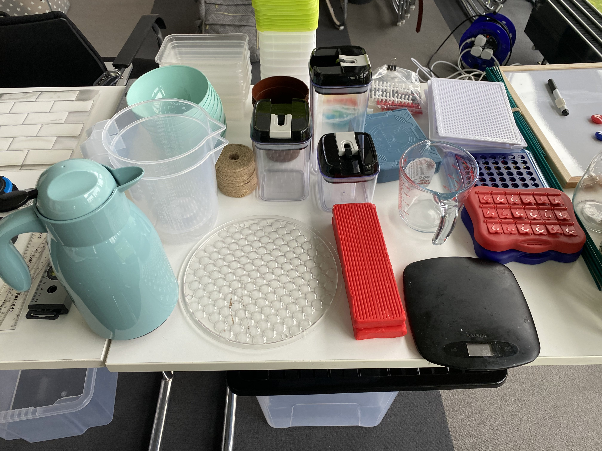
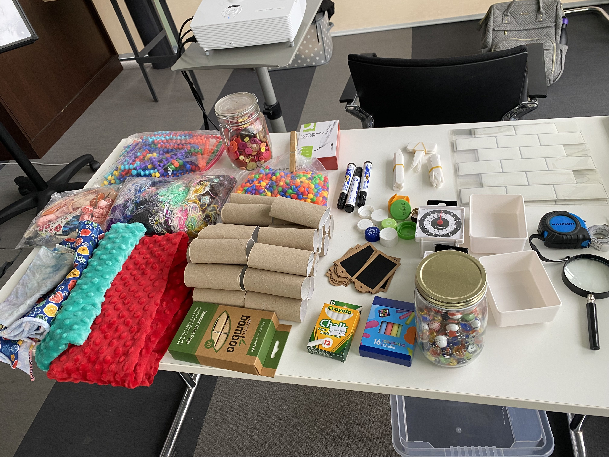
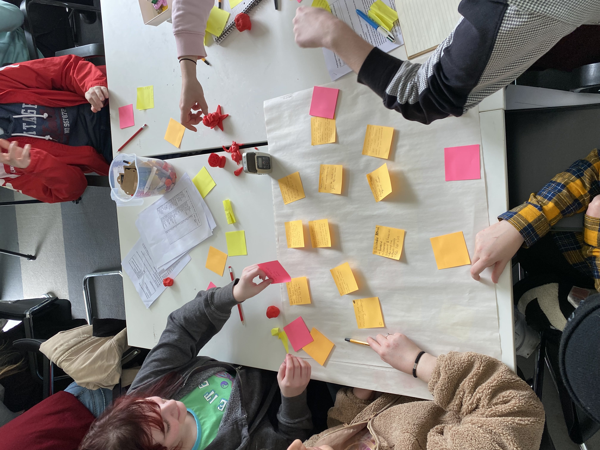

**Venue:**
    
<a href="https://informationplusconference.com/2023/" data-type="link" data-id="https://informationplusconference.com/2023/">Information+ Conference 2023</a>

Edinburgh, UK

**Date:**

Wednesday 22 November

**Organisers:**
    
SARAH HAYES, TREVOR HOGAN, REBECCA NOONAN and DENISE HEFFERNAN (<em>Munster Technological University</em>)

<a href="https://www.kimsauve.nl">KIM SAUVÉ</a> (<em>University of Bath</em>)

MARTIN LINDRUP (<em>Aalborg University</em>)

We welcome you to join our workshop<em> ZeroWaste Physkit: Fostering Sustainable Data Physicalization Education and Prototyping </em>at Information+ this November in Edinburgh. In our hands-on workshop, we will introduce the concept of <em>Zero Waste Data Physicalization Kits</em>, and explore what sustainability and environmentalism mean in the context of physical data representation.

To register visit the conference website here: <a href="https://informationplusconference.com/2023/#program">https://informationplusconference.com/2023/</a>

_Above: Images from a recent workshop in which we explored the use of different types of materials (e.g. biodegradable, reusable, repurposed) for creating data physicalizations._ 

Our workshop's objective is to develop sustainable methods for creating data physicalizations using reusable and biodegradable materials, through the introduction of the ZeroWaste PhysKit. It aims to counter the environmental impact of conventional data physicalization creation through practices that emphasise the responsible and reflective use of materials. Participants will engage in group activities to craft their own eco-friendly data physicalizations, before discussing their experiences and opinions on the wider topic of sustainability in data physicalization creation. The workshop intends to foster knowledge sharing, discussions on the benefits and challenges of adopting zero-waste strategies, and identification of future opportunities for integrating sustainability into data physicalization education and practices. Our aim is for the workshop to inspire participants to rethink their approaches to workshops, teaching, and prototyping in the context of data physicalization. Furthermore, the workshop may lead to the formation of a Special Interest Group (SIG) focused on sustainability and data physicalization. Future research directions include enabling individuals to create their own ZeroWaste PhysKits and exploring similar sustainable approaches for dynamic physicalization designs.