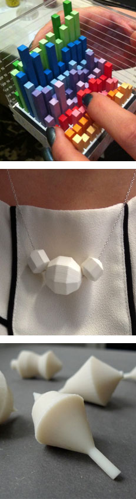

## Call for participation
[1]Humans have represented data in many forms for thousands of years, yet the main sensory channel we use to perceive these representations today still remains largely exclusive to sight. Recent developments, such as advances in digital fabrication, microcontrollers, actuated tangibles, and shape-changing interfaces offer new opportunities to encode data in physical forms and have stimulated the emergence of ‘Data Physicalization’ as a research area.

The aim of this workshop is:

  * To create an awareness of the potential of Data Physicalization by providing an overview of state-of-the-art research, practice, and tools
  * To build a community around this emerging field and start to discuss a shared research agenda.

This workshop therefore addresses both experienced researchers and practitioners as well as those who are new to the field but interested in applying Data Physicalization to their own (research) practice. The workshop will provide opportunities for participants to explore Data Physicalization hands-on, by creating their own prototypes. These practical explorations will lead into reflective discussions on the role tangibles and embodiment play in Data Physicalization and the future research challenges for this area.

For further enquiries please email hello (at) tactiledata (dot) net

To sign up for the workshop please go [here][2]

 [1]: http://dataphys.org/workshops/tei16/wp-content/uploads/sites/2/2015/10/Fig1.jpg
 [2]: http://www.tei-conf.org/16/registration.html